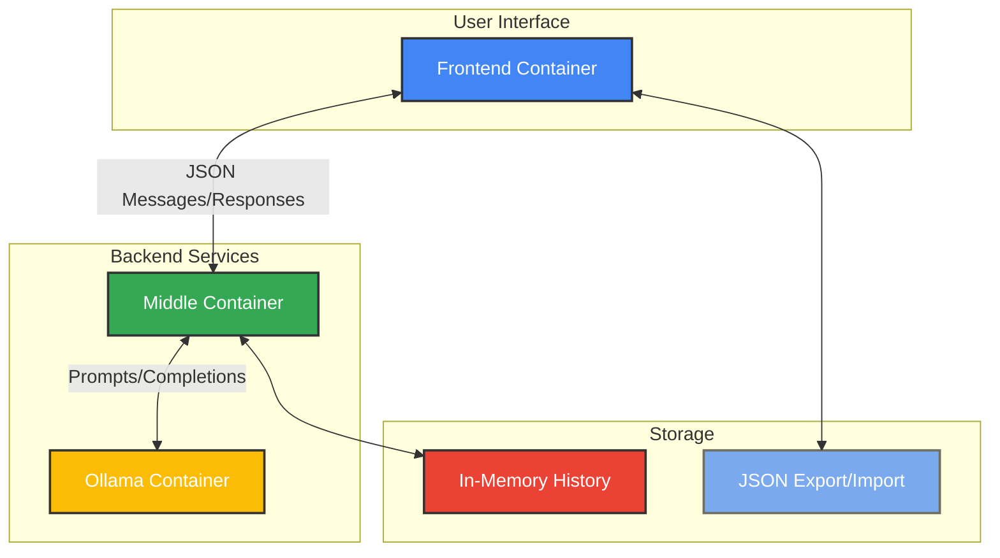
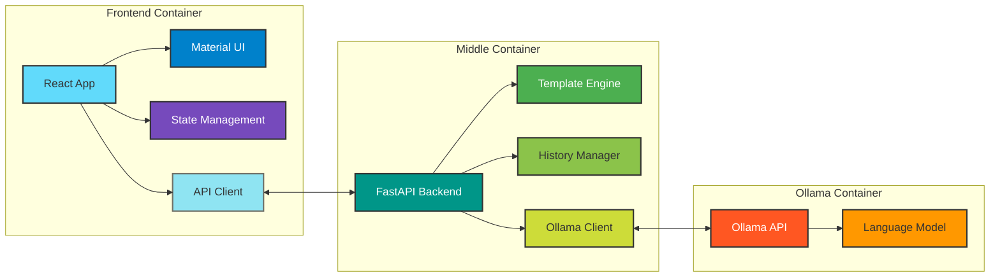
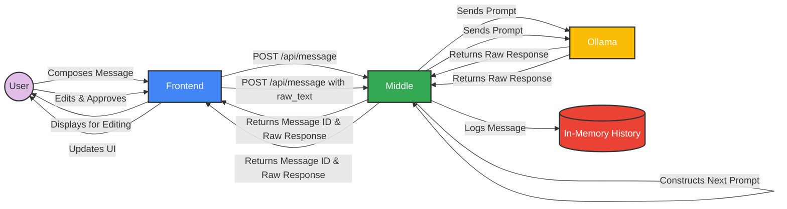
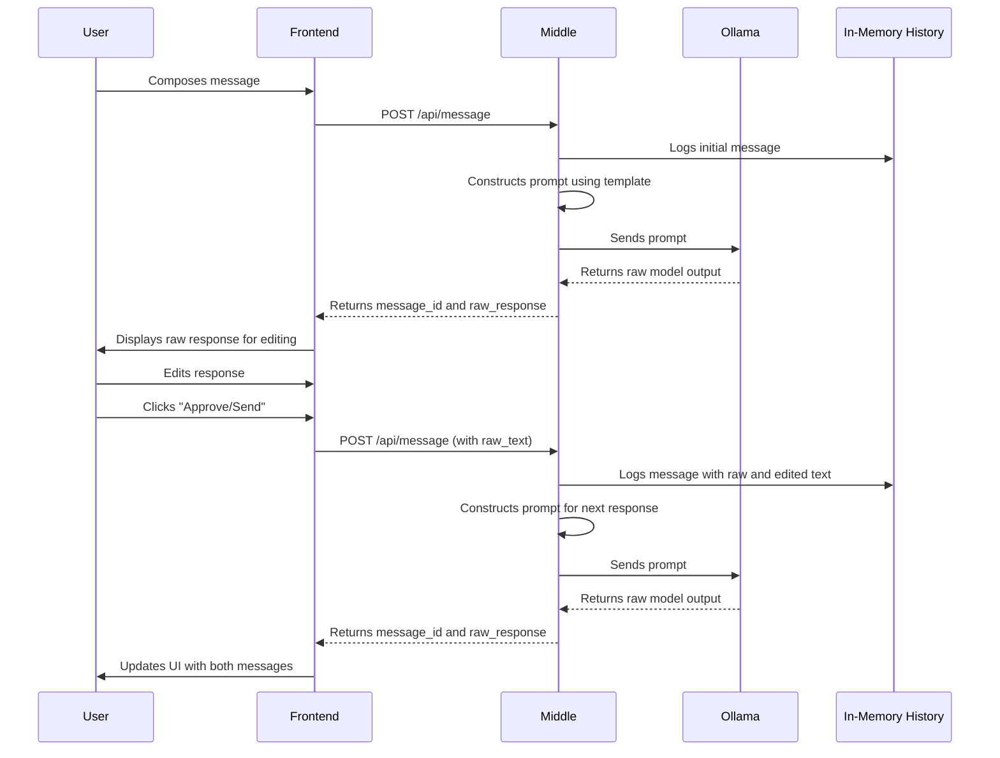
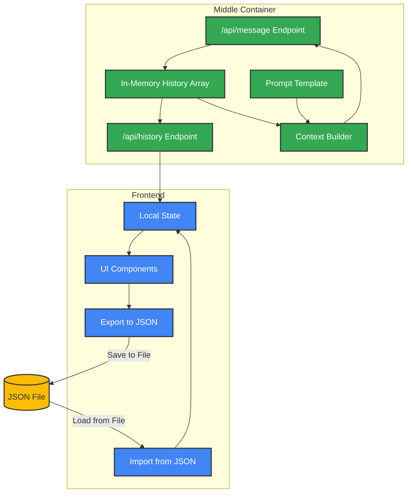
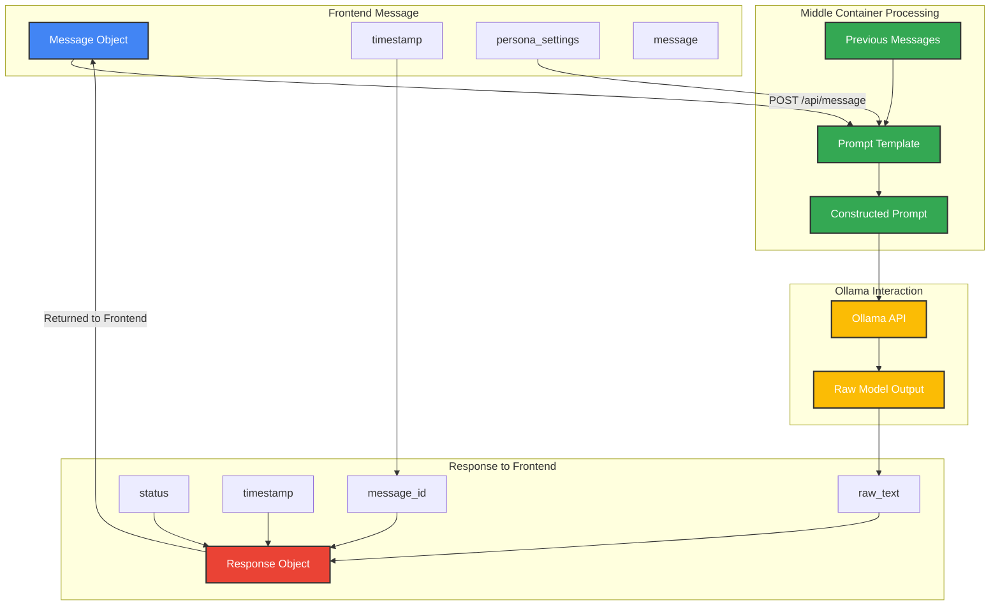
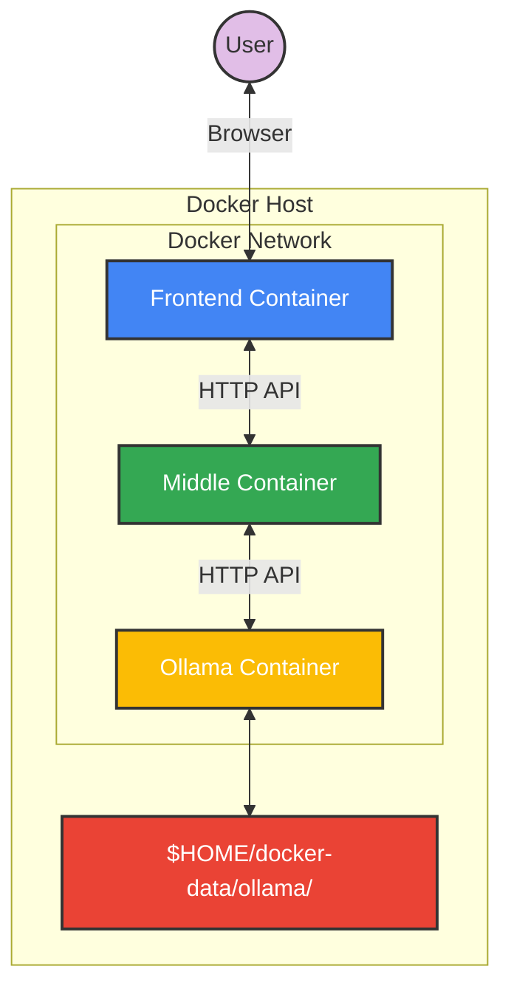

# Architecture and Data Flow Diagrams

This document provides visual representations of the multi-agentic system's architecture and data flows.

## Table of Contents

1. [System Architecture](#system-architecture)
2. [Container Interaction](#container-interaction)
3. [Data Flow Overview](#data-flow-overview)
4. [Message Processing Flow](#message-processing-flow)
5. [Conversation History Management](#conversation-history-management)

## System Architecture

## Container Interaction

## Data Flow Overview

## Message Processing Flow

## Conversation History Management

## Message Structure and Transformation

## Docker Deployment Architecture

