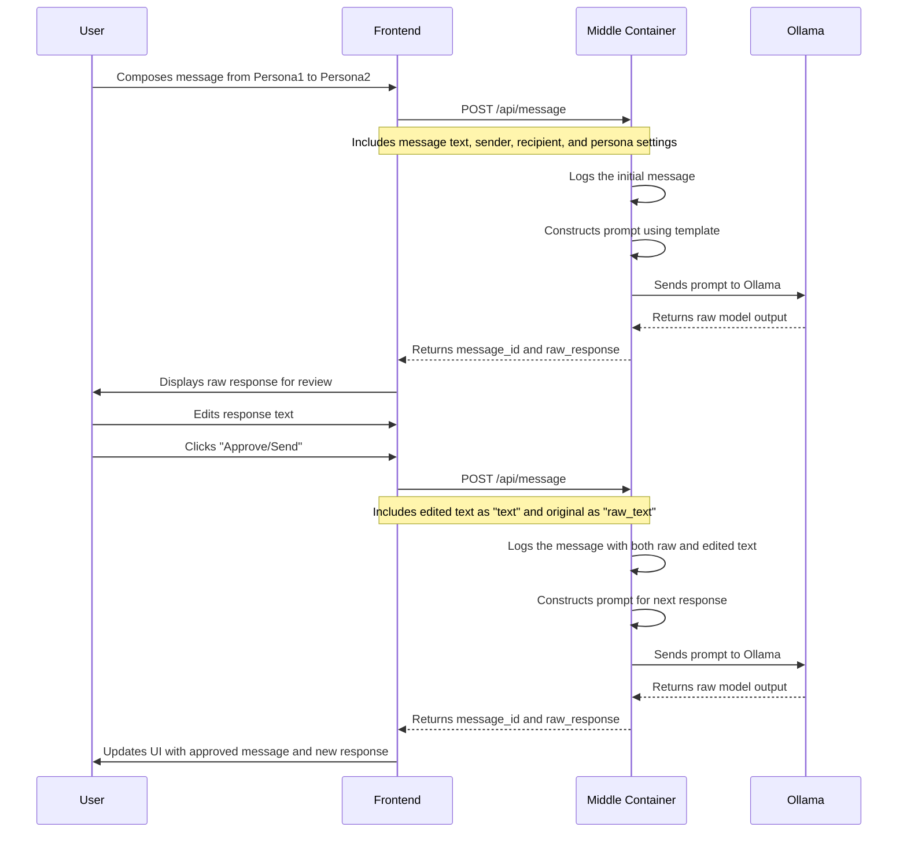
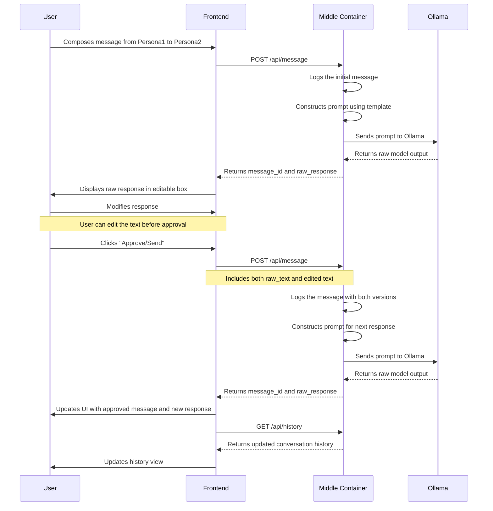
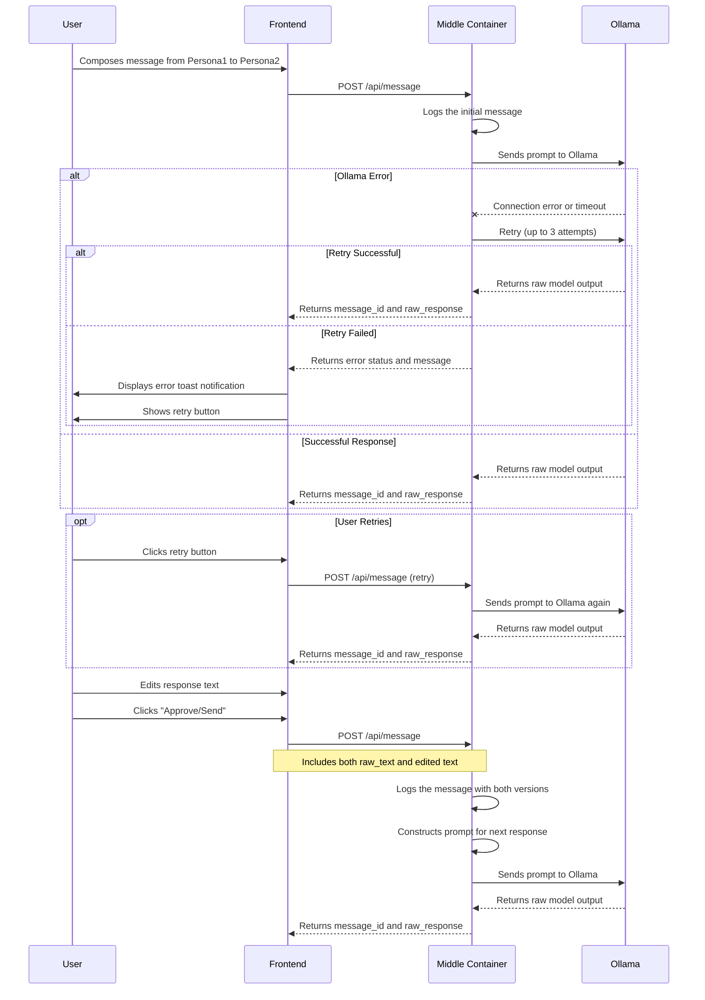
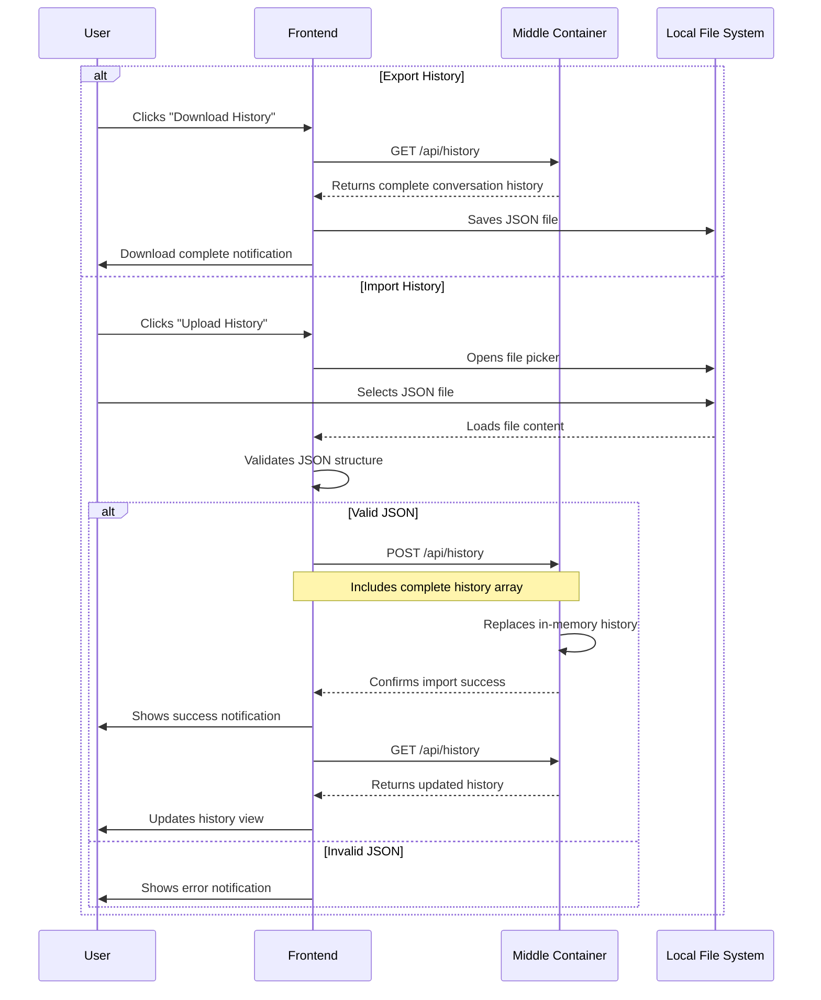
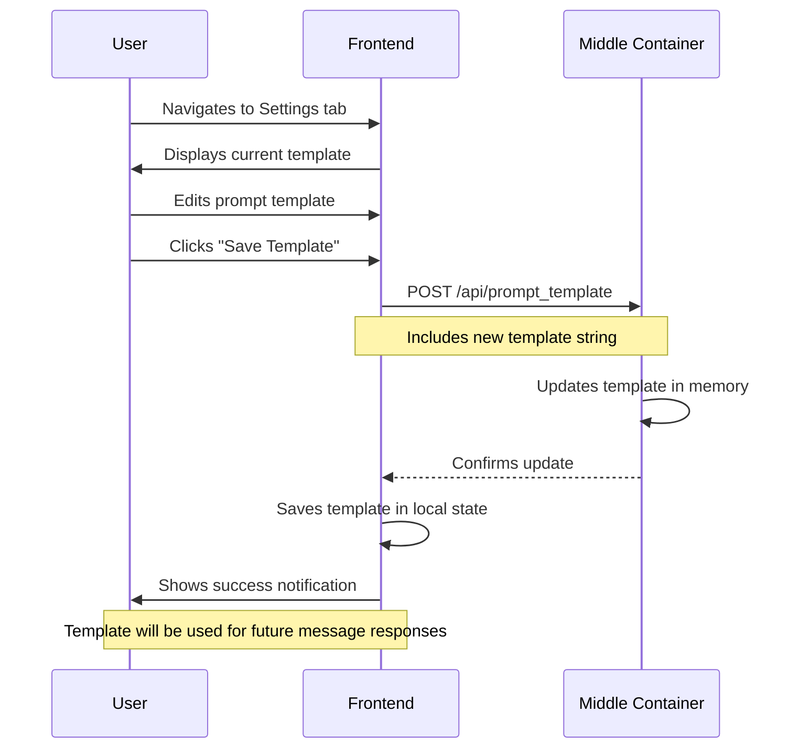
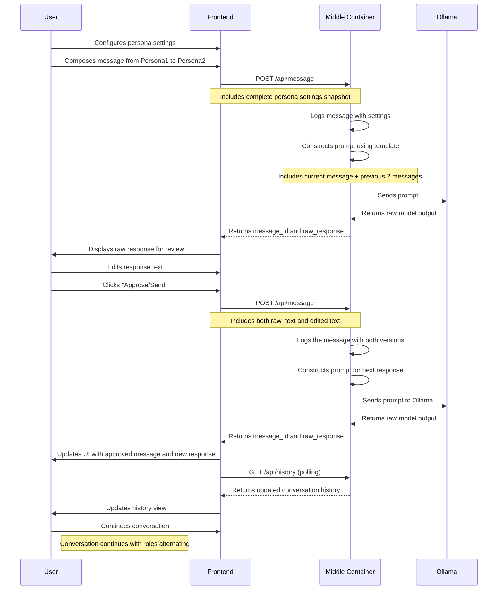

# Sequence Diagrams

This document contains sequence diagrams illustrating the message flow in the multi-agentic system.

## Table of Contents

1. [Basic Message Flow](#basic-message-flow)
2. [Message with Response Approval](#message-with-response-approval)
3. [Error Handling Flow](#error-handling-flow)
4. [History Import/Export Flow](#history-importexport-flow)
5. [Template Update Flow](#template-update-flow)

## Basic Message Flow

## Message with Response Approval

## Error Handling Flow

## History Import/Export Flow

## Template Update Flow

## Complete Message Exchange Flow

